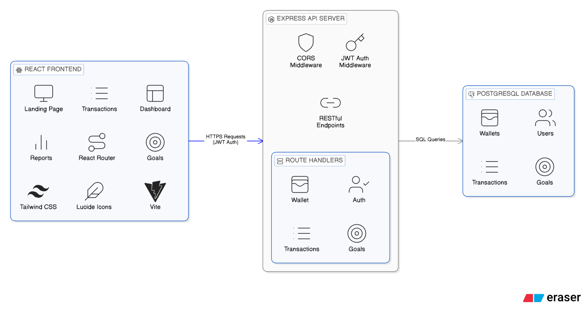
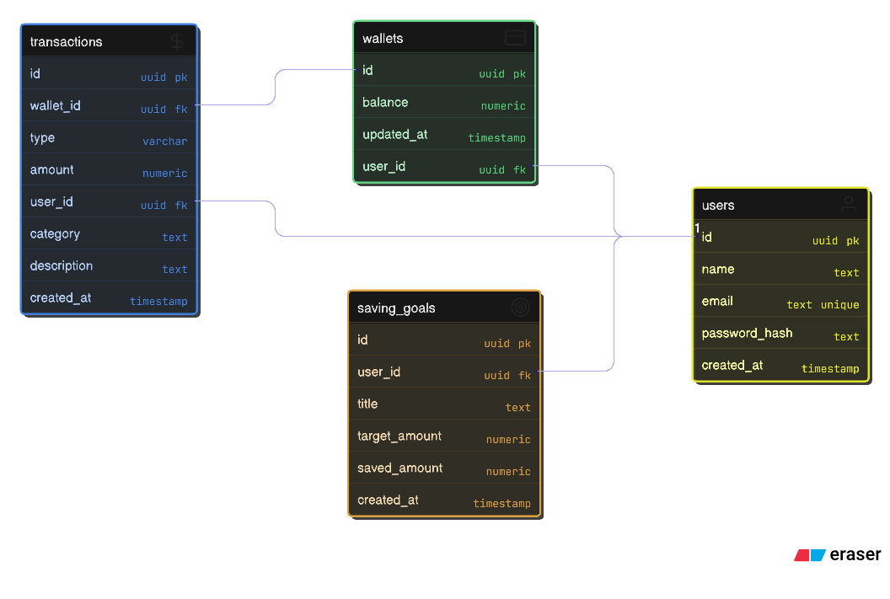

#  Flexiwallet — Personal Finance Management App

Flexiwallet is a full-stack personal finance management application that helps users track expenses, manage savings goals, and gain intelligent insights into their financial habits.

Built as a production-ready project with a focus on **clean architecture, security, and real-world fintech patterns**.

---

## Features

### Authentication
- Secure email/password login
- JWT-based authentication
- Protected routes

### Wallet & Transactions
- Single wallet per user
- Add income & expense transactions
- Atomic balance updates (no race conditions)
- Recent transactions overview

### Savings Goals
- Create multiple savings goals
- Allocate money from wallet to goals
- Progress tracking with percentages
- Prevents over-allocation

### Reports
- Income vs Expense summary
- Category-wise expense breakdown
- Download financial report as **PDF**

### AI Insights (Rule-Based)
- Summarizes spending behavior
- Highlights top expense categories
- Flags high expense vs income trends
- Explainable & deterministic (no hallucinations)

---

## Architecture Overview



**Frontend**
- React
- Tailwind CSS
- React Router

**Backend**
- Node.js
- Express
- PostgreSQL
- JWT Authentication

**Key Engineering Decisions**
- Server-side validation
- SQL aggregation for reports
- Atomic DB transactions for money flow
- Rule-based AI for explainability

---
## Database Schema



## Screenshots


### Installation

1. **Clone the repository**
```bash
git clone https://github.com/anu30singh/Personal-Finance-Management.git
cd Personal-Finance-Management
```

2. **Backend Setup**
```bash
cd backend
npm install

# Create .env file
cp .env.example .env
# Edit .env with your database credentials

# Run database migrations
npm run migrate

# Start development server
npm run dev
```

3. **Frontend Setup**
```bash
cd frontend
npm install

# Create .env file
cp .env.example .env
# Set REACT_APP_API_URL to your backend URL

# Start development server
npm start
```

4. **Access the application**
```
Frontend: http://localhost:3000
Backend API: http://localhost:5000
```
